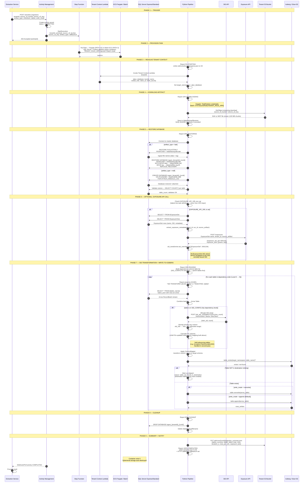
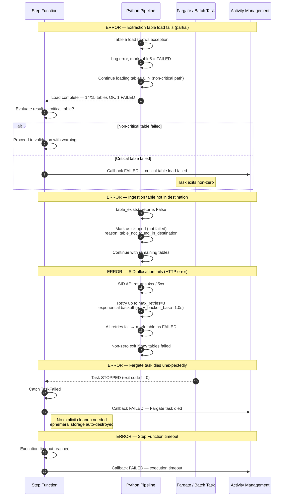
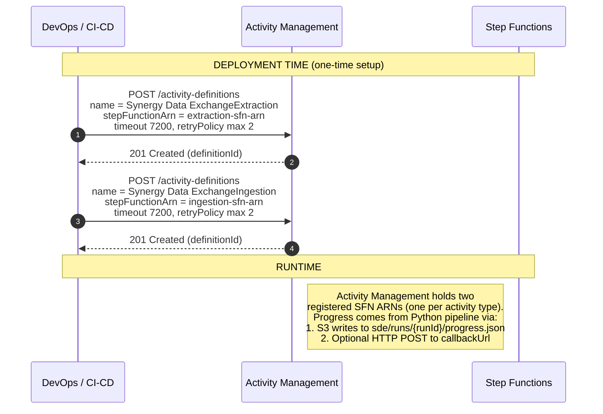

# Synergy Data Exchange Pipeline — Sequence Diagrams

## 1. Extraction: Iceberg → SQL Server → MDF/BAK → Tenant S3

### Full Sequence: End-to-End

```mermaid
sequenceDiagram
    autonumber
    participant ES as Extraction Service
    participant AM as Activity Management
    participant SFN as Step Function
    participant LMB as Check Records Lambda
    participant TCL as Tenant Context Lambda
    participant ECS as ECS Fargate / Batch
    participant SQL as SQL Server Express/Standard
    participant PY as Python Pipeline
    participant ICE as Iceberg / Glue+S3
    participant S3C as S3 Config Bucket
    participant S3T as Tenant S3 Bucket
    participant SNS as SNS

    Note over ES,SNS: PHASE 1 — TRIGGER

    ES->>AM: POST /activities<br/>tenantId, exposureIds, artifactType, tables
    AM->>AM: Create activity record<br/>status = SUBMITTED
    AM->>SFN: StartExecution<br/>tenantId, exposureIds, artifactType,<br/>activityId, S3outputpath, callbackUrl
    AM-->>ES: 202 Accepted (activityId)

    Note over ES,SNS: PHASE 2 — PRE-CHECK (Early Exit)

    SFN->>LMB: Invoke CheckRecordsLambda<br/>tenantId, exposureIds, tables
    LMB->>ICE: Lightweight Iceberg scan<br/>count rows matching exposureIds
    ICE-->>LMB: row counts per table
    LMB-->>SFN: record_check{has_records, record_count, tables_checked}

    alt No matching records
        SFN->>AM: Callback COMPLETED (early exit)<br/>no records found for exposureIds
        Note over SFN: Skip ECS task — save cost
    end

    Note over ES,SNS: PHASE 3 — PROVISION TASK

    SFN->>ECS: RunTask — Fargate (PATH 1/2) or Batch EC2 (PATH 3)<br/>SQL Server + Python pipeline (same container)<br/>PATH 1: 4 vCPU 8 GB | PATH 2: 8 vCPU 16 GB | PATH 3: 16+ vCPU 64 GB+<br/>TENANT_ROLE_ARN injected as env var if Batch mode
    ECS-->>SFN: taskArn

    Note over ES,SNS: PHASE 4 — RESOLVE TENANT CONTEXT

    PY->>TCL: Invoke Tenant Context Lambda<br/>tenantId
    TCL-->>PY: {glue_database, bucket_name,<br/>tenant_role, client_id, client_secret}
    PY->>PY: Set cfg.iceberg.namespace = glue_database

    Note over ES,SNS: PHASE 5 — INITIALIZE DATABASE

    PY->>PY: Report 10% PROVISIONING<br/>writes sde/runs/{runId}/progress.json to S3<br/>+ optional HTTP POST to callbackUrl
    PY->>SQL: CREATE DATABASE extract_{tenantId}_{runId}
    PY->>S3C: GET mapping_overrides.json (optional)<br/>CONFIG_OVERRIDE_PATH env var
    S3C-->>PY: overrides or 404
    PY->>ICE: Load Glue catalog — list tables in glue_database
    ICE-->>PY: table1, table2, ... tableN

    PY->>PY: Filter tables if TABLES input provided<br/>Build execution plan (DDL per table)

    loop For each table in plan
        PY->>ICE: Get Arrow schema for table_i
        ICE-->>PY: Arrow schema (columns, types)
        PY->>PY: Apply ColumnMapper (6-layer auto-map + overrides)
        PY->>SQL: CREATE TABLE dbo.TargetName<br/>DDL from Arrow schema
    end

    PY->>PY: Report 20% LOADING

    Note over ES,SNS: PHASE 6 — PARALLEL TABLE LOAD

    PY->>PY: ThreadPoolExecutor (MAX_WORKERS env var, default 4)

    par Table 1 — Thread 1
        PY->>ICE: scan table1<br/>row_filter = ExposureSetSID IN (101, 205, ...)<br/>selected_fields = projected cols
        ICE-->>PY: Arrow RecordBatch stream
        loop Each batch (10K rows default)
            PY->>SQL: INSERT INTO dbo.Table1<br/>WITH TABLOCK via pyodbc fast_executemany
        end
    and Table 2 — Thread 2
        PY->>ICE: scan table2 row_filter=...
        ICE-->>PY: Arrow RecordBatch stream
        loop Each batch
            PY->>SQL: INSERT INTO dbo.Table2 WITH TABLOCK
        end
    and Table N — Thread N (up to MAX_WORKERS)
        PY->>ICE: scan tableN row_filter=...
        ICE-->>PY: Arrow RecordBatch stream
        loop Each batch
            PY->>SQL: INSERT INTO dbo.TableN WITH TABLOCK
        end
    end

    Note right of PY: Tables beyond MAX_WORKERS<br/>queued and processed as<br/>threads become available

    PY->>PY: All tables loaded — collect rowCounts per table
    PY->>PY: Report 70% VALIDATING

    Note over ES,SNS: PHASE 7 — VALIDATION

    PY->>SQL: SELECT COUNT(*) FROM each table
    SQL-->>PY: row counts
    PY->>PY: Compare source (Iceberg) vs target (SQL) counts

    PY->>SQL: DBCC CHECKDB on extract_db
    SQL-->>PY: integrity OK

    PY->>SQL: Check PK / UNIQUE constraints
    SQL-->>PY: constraints OK

    PY->>PY: Generate checksums via HASHBYTES

    alt Validation PASSED
        PY->>PY: validationReport = pass
    else Validation FAILED
        PY->>PY: Raise ValidationError
        PY->>PY: Report 0% FAILED + error details
        Note over ECS: Task exits non-zero<br/>Step Function catches failure
    end

    PY->>PY: Report 80% GENERATING_ARTIFACT

    Note over ES,SNS: PHASE 8 — GENERATE ARTIFACT

    Note right of SQL: Artifacts written to /data/backup<br/>(mssql-owned volume, not /tmp)

    alt artifactType = bak
        PY->>SQL: BACKUP DATABASE extract_db<br/>TO DISK = /data/backup/extract_db.bak
        SQL-->>PY: .bak file on shared volume
    else artifactType = mdf
        PY->>SQL: ALTER DATABASE extract_db<br/>SET SINGLE_USER WITH ROLLBACK IMMEDIATE
        PY->>SQL: EXEC sp_detach_db extract_db
        SQL-->>PY: .mdf + .ldf on shared volume
    else artifactType = both
        PY->>SQL: BACKUP DATABASE (create .bak first)
        PY->>SQL: sp_detach_db (detach for .mdf + .ldf)
    end

    PY->>PY: Compute SHA256 checksums per file
    PY->>PY: Report 90% UPLOADING

    Note over ES,SNS: PHASE 9 — UPLOAD TO TENANT S3

    Note right of PY: Fargate: uses TaskRoleArn (no STS)<br/>Batch: STS AssumeRole(TENANT_ROLE_ARN)

    loop For each artifact file
        PY->>S3T: CreateMultipartUpload<br/>{S3outputpath}/{activityId}/filename
        loop Each 100 MB part
            PY->>S3T: UploadPart
        end
        PY->>S3T: CompleteMultipartUpload
        PY->>PY: Verify S3 ETag vs local SHA256
    end

    PY->>S3T: PUT manifest.json alongside artifacts<br/>{S3outputpath}/{activityId}/manifest.json

    Note over ES,SNS: PHASE 10 — CLEANUP + NOTIFY

    PY->>SQL: DROP DATABASE extract_db
    PY->>PY: Report 100% COMPLETED<br/>writes progress.json to S3<br/>+ HTTP callback if callbackUrl set

    Note right of ECS: Container exits 0<br/>Ephemeral storage auto-destroyed

    SFN->>SNS: Publish completion event<br/>tenantId, activityId, artifactType,<br/>s3Location, checksum

    AM-->>ES: Webhook/Poll activity COMPLETED
    ES->>ES: Process result
```

## 2. Ingestion: Tenant S3 → BAK/MDF → SQL Server → SID Transform → Iceberg

### Full Sequence: End-to-End

---

## 3. Error Handling Sequence

---

## 4. Activity Management Integration

---

## Credential Flow Summary

| Mode | S3 / Tenant Bucket Access | SID / Exposure API Auth |
|------|---------------------------|------------------------|
| **ECS Fargate** | TaskRoleArn assigned at runtime by Step Functions — no STS needed | OAuth: Tenant Context Lambda → `client_id/secret` → Okta token endpoint → Bearer token |
| **AWS Batch** | STS AssumeRole with `TENANT_ROLE_ARN` env var injected by Step Functions | OAuth: same Tenant Context Lambda flow |

## Progress Reporting Summary

Progress is reported via **two channels** on every `reporter.report()` call:

| Channel | Key / Target | Description |
|---------|--------------|-------------|
| **S3 (always)** | `sde/runs/{runId}/progress.json` | Polled by Activity Management API for UI updates |
| **HTTP (optional)** | `callbackUrl` from Step Functions input | Direct push notification to Activity Management |

Writes are fire-and-forget via a background daemon thread — never blocks the pipeline critical path.

